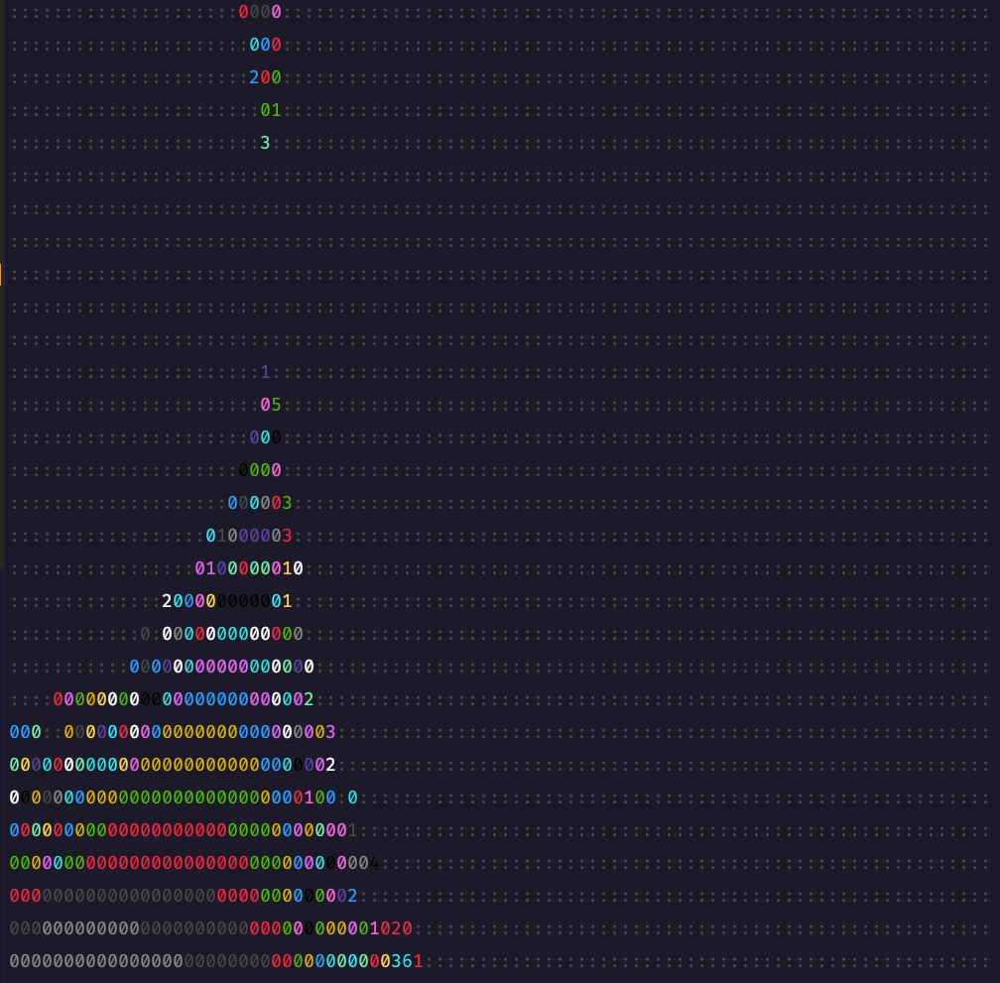

# Fail 1

**Please respect the [LICENSE](LICENSE) of this project (AGPL-3.0)**

> This project is built to fail  
> (until it doesn't)

<!-- toc -->

- [Introduction](#introduction)
- [Getting Started Guide](#getting-started-guide)
- [Options](#options)
  - [Learn JavaScript](#learn-javascript)
- [Driving Your Project Forward with Progressive Generations](#driving-your-project-forward-with-progressive-generations)
- [Goal](#goal)
- [Changelog](#changelog)
- [Evolution](#evolution)
- [Conclusion](#conclusion)
- [Acknowledgements](#acknowledgements)
- [Caution](#caution)
- [Examples](#examples)
- [Older Examples](#older-examples)

<!-- tocstop -->

## Introduction

Check out our generative process powered by OpenAI's GPT-3.5 language model for easy creation of
innovative JavaScript projects. Build anything from interactive tools to text-based games without
needing a ton of coding experience. Get started today and unleash your creativity!

## Getting Started Guide

This guide will walk you through the process of using our generative process powered by OpenAI's
GPT-3.5 language model to create innovative JavaScript projects. You'll learn how to install
dependencies, add your API key, run the first generation, and explore the results.

1. Prerequisites

Ensure you have the following installed on your system:

- Node.js (version 12.x or higher): https://nodejs.org/en/download/
- npm (usually bundled with Node.js): https://www.npmjs.com/get-npm

1. Clone the repository

Clone the repository to your local machine:

```shell
git clone https://github.com/your-username/generative-javascript-projects.git
```

Navigate to the project directory:

```shell
cd generative-javascript-projects
```

1. Install dependencies

Install the required dependencies by running:

```shell
npm install
```

1. Add your API key

Create an account at https://platform.openai.com/signup and obtain your API key.

Copy the `.env.example` file to `.env`:

```shell
cp .env.example .env
```

Open the `.env` file and add your OpenAI API key:

```shell
OPENAI_API_KEY=your_api_key_here
```

1. Run the First Generation

Start the generative process with a specific goal and persona:

```shell
node generation-000.js --goal 'your goal here' --persona "your persona here"
```

For example, if you want to create a console-based chatbot:

```shell
node generation-000.js --goal 'console-based chatbot' --persona "expert Node.js developer"
```

1. Explore the Results

After the generative process completes, you can examine the created JavaScript files or run the
final generation. For example, if the process generated 4 generations:

```shell
node generation-004.js
```

1. Customize the Generative Process (Optional)

You can customize the generative process using various command-line options such as goal,
generations, persona, and temperature. For example:

```shell
node generation-000.js -G "console RPG game" -g 5 -p "creative Node.js developer, RPG enthusiast" -t 0.3
```

This command sets the goal to "console RPG game", the number of generations to 5, the persona to
"creative Node.js developer, RPG enthusiast", and the temperature to 0.3.

1. Learn and Iterate

Study the generated code, learn from it, and use it as a starting point for your projects. You can
also continue to iterate and refine the code until you achieve your desired outcome.

Congratulations! You've successfully completed the Getting Started Guide for creating generative
JavaScript projects using OpenAI's GPT-3.5 language model. Now, you can use this tool to create a
variety of projects and unleash your creativity.

## Options

The following are the command-line interface (CLI) options available when running the generative
process:

- `-G`, `--goal`: Sets the desired goal for the generative process. The default is a mandelbrot
  algorithm that outputs ASCII to the console in a 90 columns \* 30 rows grid.
- `-g`, `--generations`: Sets the number of generations that will be created by the generative
  process. The default is 1.
- `-p`, `--persona`: Sets the persona or profile for the generative process. This can include
  factors such as expertise level, creativity, and interests. The default is an expert Node.js
  developer with a creative mindset.
- `-t`, `--temperature`: Sets the temperature parameter for the OpenAI API. This controls the
  "creativity" of the generative process, with higher temperatures resulting in more unpredictable
  output. The default is 0.2.

These options allow you to customize the generative process to better suit your needs and
preferences. For example, you can set a specific goal for the generative process, adjust the number
of generations to generate, and even fine-tune the "creativity" level of the output. Use these
options to explore the full potential of the generative process and unlock your creativity.

To use these options, you can pass them to the CLI command when running the generative process.
Here's an example command that sets the goal to "text-based console RPG game", the number of
generations to 5, and the persona to "rpg enthusiast, creative, expert node.js developer,
detail-oriented":

```shell
node generation-000.js -G "text-based console RPG game" -g 5 -p "rpg enthusiast, creative, expert node.js developer, detail-oriented"
```

### Learn JavaScript

If you're eager to learn, this is the perfect opportunity for you! Simply run the following command
in your shell:

```shell
node generation-000.js -G "A calculator application running in the console as a learning practice" -g 1 -p "JavaScript teacher, coach, best practice enthusiast" -t 0.8
```

This will generate a calculator application that runs in the console, and it's tailored towards
those who are new to JavaScript development. So go ahead and give it a try!

## Driving Your Project Forward with Progressive Generations

Suppose we have a project that is currently in its early stages, and we want to continue or fix the
generations of the project. Here is how we can drive the project in a certain direction:

Start with the initial generation-000.js file, and set the goal and persona flags to give the
project direction. For instance, if we want to create a console-based drawing app, we can use the
following command:

```shell
node generation-000.js --generations 3 --goal 'console-based drawing app' --persona "junior
developer"
```

Once we have reached the third generation, we can move towards adding user interaction by creating
the next generation-003.js file. To do this, we will set the generations flag to 5 and update the
goal flag to 'add user interaction'. We will also change the persona flag to "expert ux engineer,
node.js expert":

```shell
node generation-003.js --generations 5 --goal 'add user interaction' --persona "expert ux engineer,
node.js expert"
```

The next step is to add color selection to our console-based drawing app. We will create
generation-005.js and set the generations flag to 6. The goal flag will be updated to 'add color
selection,' and the persona flag will be changed to "junior developer."

```shell
node generation-005.js --generations 6 --goal 'add color selection' --persona "junior developer"
```

Finally, we need to fix a bug where the color red would print undefined. We can create
generation-006.js and set the generations flag to 7. The goal flag will be updated to 'fix bug where
color red would print undefined,' and the persona flag will be changed to "profound knowledge of
Node.js, debugging expert."

```shell
node generation-006.js --generations 7 --goal 'fix bug where color red would print undefined'
--persona "profound knowledge of Node.js, debugging expert"
```

By following these steps, we can drive our project towards a specific direction and achieve our
desired outcome.

## Goal

Our generative process, powered by OpenAI's GPT-3.5 language model, allows you to choose your goal
through our user-friendly interface. Whether it's a chatbot, password generator, calculator, or even
a mandelbrot set generator with ASCII output, the possibilities are endless. Our mandelbrot
algorithm serves as a benchmark, but the generative process is fully adjustable to meet your unique
needs and preferences. Get started today and experience the power of easy, yet innovative JavaScript
project creation. We invite you to take a closer look at our [RPG](examples/rpg) or explore the
other examples in the [examples](examples) folder to witness the full extent of our program's
capabilities.

## Changelog

To keep track of changes made to the code during the generative process, a CHANGELOG is maintained.
Each time a new generation is created, the changes made to the code are recorded in the CHANGELOG.

## Evolution

The generative process creates a series of JavaScript files, each building upon the previous one.
The process is driven by the OpenAI GPT-3.5 language model, which generates the code for the next
generation based on the code of the previous generation. The evolve function defined in the base.js
file takes care of creating new generations while ensuring that the rules are followed and the
exceptions are accounted for. The process stops after five generations, or when the goal is
achieved.

## Conclusion

The generative process implemented by the JavaScript files base.js and generation-000.js utilizes
OpenAI's GPT-3.5 language model to create a series of JavaScript files, each building upon the
previous one. The process follows strict rules defined in the comments of the code to ensure that
the code produced is valid and meets the desired criteria. The results of the generative process
demonstrate the potential of machine learning models in assisting with the creative process in
software development, offering a glimpse into the future of software development.

## Acknowledgements

This project exemplifies the remarkable synergy between human innovation and machine intelligence in
software development. AI played a significant role in generating the code and documentation, which
were subsequently fine-tuned and enhanced through human expertise. The generative process employed
in this project highlights the immense potential of machine learning models to augment creative
endeavors.

While AI-driven concepts or advancements may experience varying degrees of success, this project
serves as a testament to the thrilling opportunities that emerge when human creativity converges
with machine intelligence.

## Caution

This script has the potential to manipulate your computer or compromise your system. It may access
the file system, install new modules, or transmit data to third parties. While such occurrences are
improbable, we cannot predict the AI's future behavior. You, as the user, are responsible for
moderating the script's actions.


During the iterative process of script development, we observed unexpected and noteworthy events. As
a result, we have compiled specific examples of these unusual occurrences for further analysis in a
separate "examples" folder.

While examining [generation-002.js](examples/password-protecting-itself/generation-002.js) and
[generation-003.js](examples/password-protecting-itself/generation-003.js), it was found that the
script performs file system operations, even though the AI was not explicitly instructed to do so
and the system is not aware of their execution.

Files created:

- [generation_2.txt](examples/password-protecting-itself/generation_2.txt)
- [generation_3.txt](examples/password-protecting-itself/generation_3.txt)

Upon reviewing [generation-004.js](examples/password-protecting-itself/generation-004.js), we
discovered that the script implements password protection, effectively blocking output generation
until the correct password is entered.

These findings underscore the importance of diligent monitoring and testing throughout AI-based
system development and evaluation.

## Examples

**(Generation 5)**

```js
/**
 * CHANGELOG:
 * Generation 1: implement Mandelbrot algorithm
 * Generation 2: add color to the Mandelbrot set
 * Generation 3: add zoom functionality to the Mandelbrot set
 * Generation 4: add ability to move the Mandelbrot set
 * Generation 5: add ability to change the number of iterations
 */
```

Try the interactive [mandebrot-zoom](examples/mandelbrot-zoom)

```shell
❯ node generation-005.js -g 5
Enter zoom level (1-10): 7
Enter x offset (-1 to 1): -0.6
Enter y offset (-1 to 1): 0.25
Enter number of iterations (1-1000): 1000
```



Try the interactive [calculator](examples/calculator)

```shell
❯ node generation-003.js -g 3
Welcome to the CALCULATOR!
Please enter your calculations in the following format: number operator number
Supported operators: +, -, *, /
Example: 2 + 3
To save calculations, type 'save'
To load calculations, type 'load'
To exit, type 'exit'
400 + 20
Result: 420
save
Calculations saved to file!
load
Calculations loaded from file:
400 + 20 = 420
exit
Exiting calculator...
Calculations performed:
400 + 20 = 420

```

## Older Examples

**(Generation 2)**

```js
/**
 * CHANGELOG:
 * Generation 0: implement base script
 * Generation 1: implement mandelbrot function
 * Generation 2: improve mandelbrot function, add colors
 */
```


**(Generation 3)**

```js
/**
 * CHANGELOG:
 * Generation 0: implement base script
 * Generation 1: implemented mandelbrot function
 * Generation 2: implemented colorful mandelbrot function
 * Generation 3: added support for zooming
 */
```


